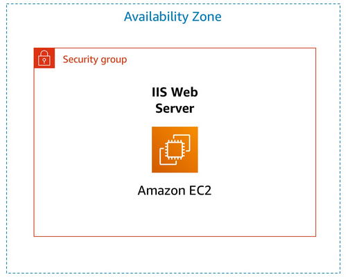
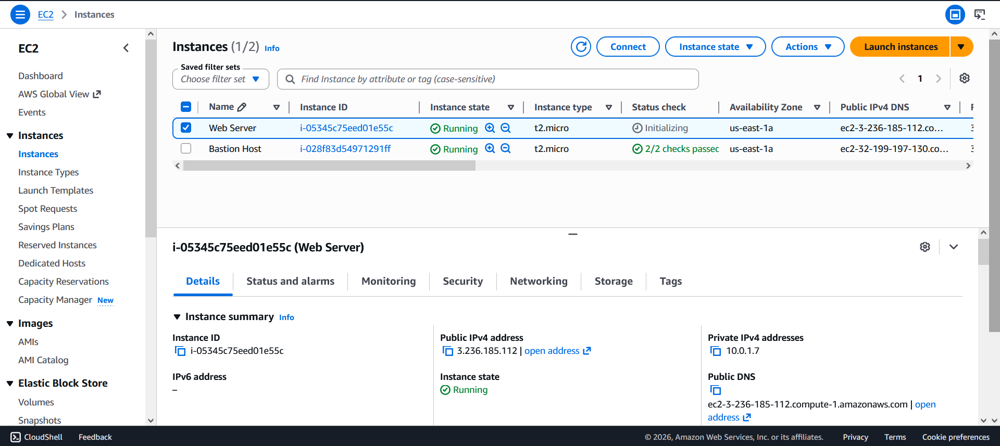
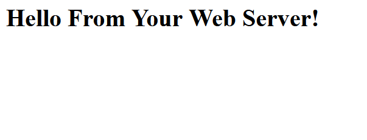
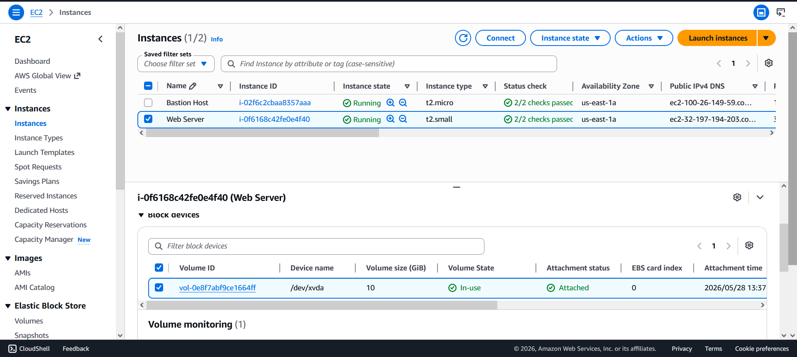
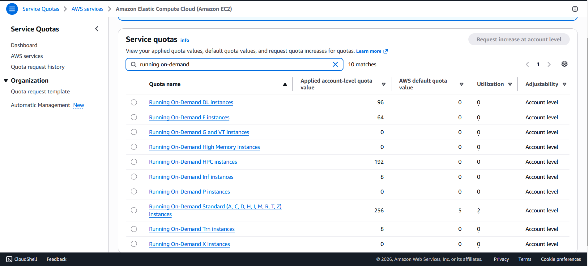
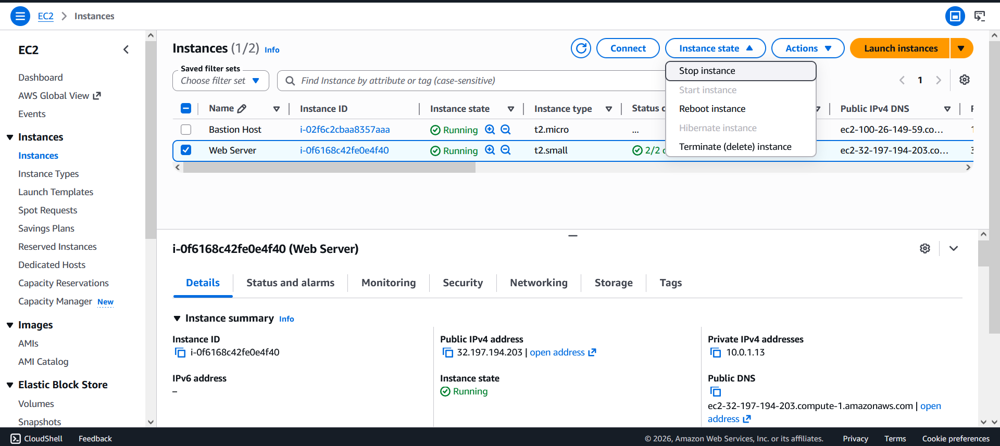
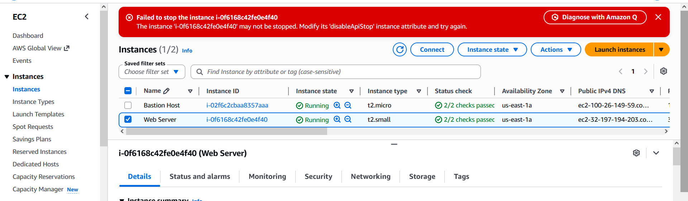
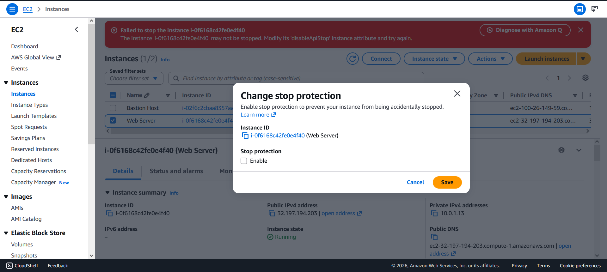
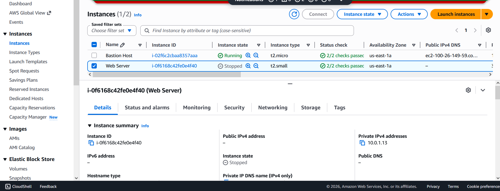

# 🚀 AWS EC2 Lab — Introduction to Amazon EC2


> A hands-on lab covering the fundamentals of launching, configuring, monitoring, resizing, and managing Amazon EC2 instances on AWS.

---

## 📋 Table of Contents

- [Overview](#-overview)
- [Objectives](#-objectives)
- [Architecture](#-architecture)
- [Lab Tasks](#-lab-tasks)
- [Technologies Used](#-technologies-used)
- [Key Concepts](#-key-concepts)
- [Prerequisites](#-prerequisites)
- [Notes](#-notes)

---

## 🌐 Overview

**Amazon Elastic Compute Cloud (Amazon EC2)** is a web service that provides resizable compute capacity in the cloud. This lab walks through the core EC2 workflow — from launching a web server instance to monitoring its health, adjusting security rules, resizing resources, and testing instance protection features.

---

## 🎯 Objectives

By completing this lab, you will be able to:

- ✅ Launch a web server EC2 instance with **termination protection** enabled
- ✅ **Monitor** an EC2 instance using CloudWatch and system logs
- ✅ Modify a **security group** to allow HTTP traffic on port 80
- ✅ **Resize** an EC2 instance type and expand an EBS volume
- ✅ Explore **EC2 Service Quotas** and regional limits
- ✅ Enable and test **stop protection**
- ✅ Properly **stop** an EC2 instance

---

## 🏗️ Architecture


---

## 🧪 Lab Tasks

### Task 1 — 🖥️ Launch Your EC2 Instance

- Named the instance **`Web Server`**
- Selected **Amazon Linux 2023 AMI** with instance type **`t2.micro`**
- Created a new security group: **`Web Server security group`**
- Enabled **Termination Protection**
- Injected the following **User Data** script to auto-deploy a web server:

```bash
#!/bin/bash
dnf install -y httpd
systemctl enable httpd
systemctl start httpd
echo '<html><h1>Hello From Your Web Server!</h1></html>' > /var/www/html/index.html
```

---

### Task 2 — 📊 Monitor Your Instance

- Reviewed **Status Checks** (System reachability & Instance reachability)
- Explored **CloudWatch metrics** on the Monitoring tab
- Retrieved the **System Log** to confirm Apache (`httpd`) installation
- Captured an **Instance Screenshot** for visual status verification

---

### Task 3 — 🔒 Update Security Group & Access Web Server

- Identified that inbound **port 80 (HTTP)** was blocked by default
- Added an inbound rule to the security group:
  - **Type:** HTTP
  - **Source:** Anywhere-IPv4 (`0.0.0.0/0`)
- Successfully accessed the web server in the browser:
  > `Hello From Your Web Server!`

---


### Task 4 — ⚙️ Resize Instance & EBS Volume

| Resource | Before | After |
|---|---|---|
| Instance Type | `t2.micro` (1 vCPU / 1 GiB RAM) | `t2.small` (1 vCPU / 2 GiB RAM) |
| EBS Volume | 8 GiB | 10 GiB |

- Enabled **Stop Protection** on the resized instance

---

### Task 5 — 📏 Explore EC2 Limits

- Navigated to **AWS Service Quotas** for EC2
- Reviewed **Running On-Demand** instance limits per region
- Learned how to request limit increases through the AWS console


---

### Task 6 — 🛡️ Test Stop Protection

- Attempted to stop the instance → received a **`disableApiStop`** error (protection working ✅)
- Disabled stop protection via **Instance Settings → Change Stop Protection**
- Successfully stopped the instance




---

## 🛠️ Technologies Used

| Service | Purpose |
|---|---|
| **Amazon EC2** | Virtual server compute |
| **Amazon EBS** | Persistent block storage |
| **Amazon CloudWatch** | Instance monitoring & metrics |
| **AWS Security Groups** | Virtual firewall for traffic control |
| **AWS Service Quotas** | Regional resource limit management |
| **Apache HTTP Server** | Web server deployed via User Data |

---

## 💡 Key Concepts

- **AMI (Amazon Machine Image):** Template used to launch EC2 instances
- **Security Group:** Acts as a virtual firewall; controls inbound/outbound traffic
- **User Data:** Shell scripts that run automatically on first instance boot
- **Termination Protection:** Prevents accidental deletion of an EC2 instance
- **Stop Protection:** Prevents accidental stopping of an EC2 instance
- **EBS Volume:** Network-attached storage that persists independently of instance state
- **Instance Types:** Define the hardware profile (CPU, RAM, networking) of an EC2 instance

---

## ✅ Prerequisites

- An active **AWS Account** with access to the AWS Management Console
- Basic familiarity with cloud computing concepts
- Lab environment provisioned with **Lab VPC** and appropriate IAM permissions

---

## 📝 Notes

- 🌍 All resources were provisioned in the **`us-east-1` (N. Virginia)** region
- 🔑 A key pair (`vockey`) was assigned but not used for direct SSH access in this lab
- ⚠️ Instance types and EBS volume sizes may be restricted depending on lab environment quotas
- 💰 Stopped EC2 instances do **not** incur compute charges, but attached EBS volumes **do**

---

<div align="center">

**© 2023 Amazon Web Services, Inc. — Lab for educational purposes only.**

⭐ *If you found this helpful, consider starring the repository!*

</div>
