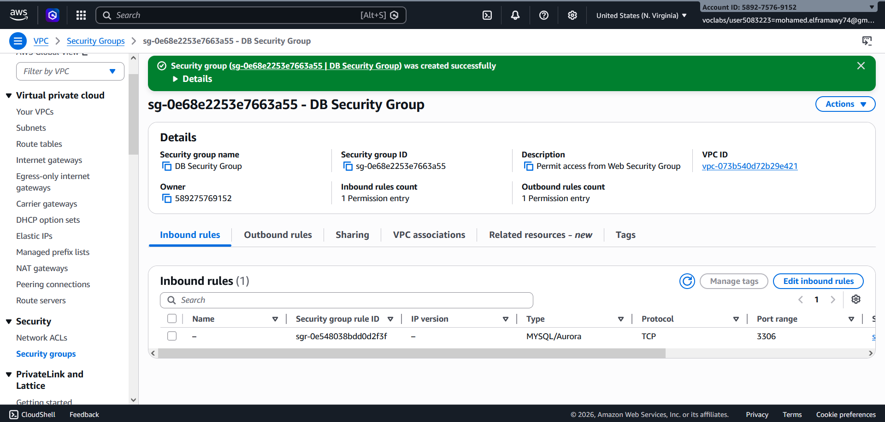
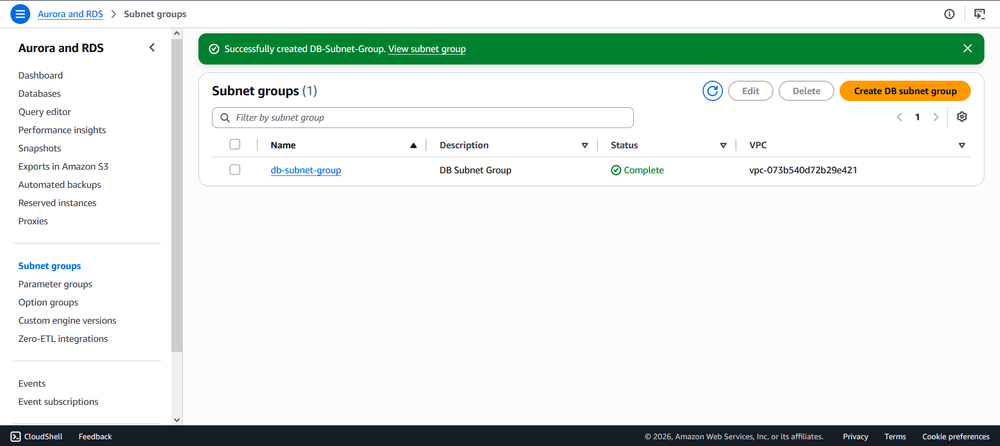
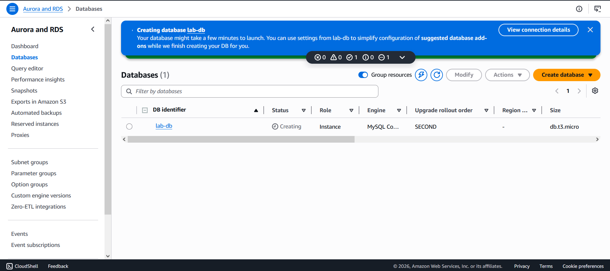
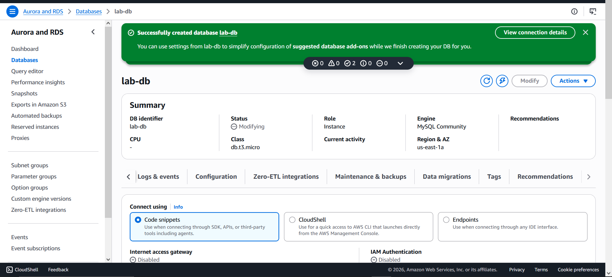
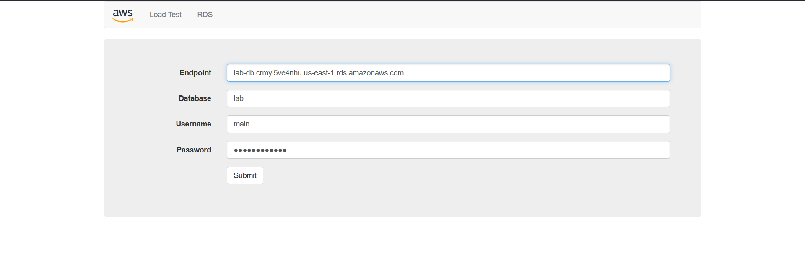
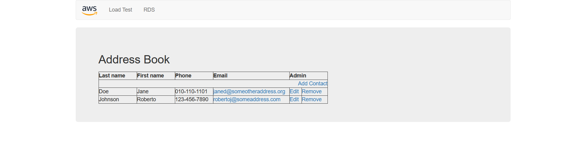
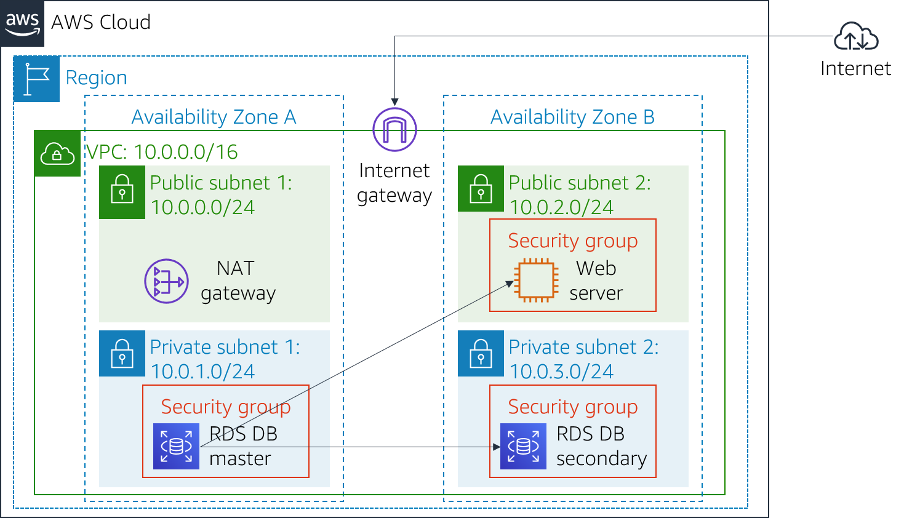

# 🗄️ Lab 5: Build Your DB Server & Interact With Your DB Using an App


---

## 📋 Overview

This lab demonstrates how to leverage **Amazon RDS (Relational Database Service)** to set up a managed, highly available MySQL database in the cloud and connect it to a live web application.

> Amazon RDS makes it easy to set up, operate, and scale a relational database in the cloud — handling time-consuming administration tasks so you can focus on your application and business logic.

---

## 🎯 Objectives

By the end of this lab, you will be able to:

- ✅ Launch an **Amazon RDS DB instance** with high availability (Multi-AZ)
- ✅ Configure the DB instance to **permit connections** from your web server
- ✅ Open a **web application** and interact with your database in real time

---

## 🏗️ Architecture


---

## 🛠️ AWS Services Used

| Service | Purpose |
|--------|---------|
| 🔒 **Amazon VPC** | Network isolation and security groups |
| 🗄️ **Amazon RDS** | Managed MySQL database with Multi-AZ |
| 🖥️ **Amazon EC2** | Web server hosting the application |
| 🌐 **Security Groups** | Firewall rules controlling DB access |

---

## 📌 Lab Tasks

### Task 1 — 🔒 Create a Security Group for the RDS DB Instance

Created a dedicated security group `DB Security Group` that allows inbound **MySQL/Aurora (port 3306)** traffic exclusively from the **Web Security Group**.

**Key Configuration:**
- **Security Group Name:** `DB Security Group`
- **Description:** Permit access from Web Security Group
- **VPC:** Lab VPC
- **Inbound Rule:** MySQL/Aurora (3306) ← Web Security Group


---

### Task 2 — 🌐 Create a DB Subnet Group

Created a subnet group `DB-Subnet-Group` spanning **two Availability Zones** to enable Multi-AZ deployment.

**Key Configuration:**
- **Name:** `DB-Subnet-Group`
- **VPC:** Lab VPC
- **Availability Zones:** `us-east-1a`, `us-east-1b`
- **Subnets:** `10.0.1.0/24`, `10.0.3.0/24`


---

### Task 3 — 🗄️ Create an Amazon RDS DB Instance

Launched a **Multi-AZ MySQL** RDS instance for high availability and durability.

**Key Configuration:**

| Parameter | Value |
|-----------|-------|
| Engine | MySQL |
| Template | Dev/Test |
| Availability | Multi-AZ DB Instance |
| DB Identifier | `lab-db` |
| Master Username | `main` |
| Master Password | `lab-password` |
| Instance Class | `db.t3.micro` (Burstable) |
| Storage | 20 GB General Purpose SSD |
| VPC | Lab VPC |
| Security Group | DB Security Group |
| Initial DB Name | `lab` |



> 💡 **Multi-AZ** automatically creates a primary DB instance and synchronously replicates data to a standby instance in a different AZ — ensuring high availability and failover support.

---

### Task 4 — 🌍 Interact with Your Database

Connected a **web-based Address Book application** (hosted on EC2) to the RDS database using the endpoint copied from the console.

**Connection Settings Used:**
```
Endpoint : lab-db.xxxx.us-east-1.rds.amazonaws.com
Database : lab
Username : main
Password : lab-password
```



Successfully performed **CRUD operations** (Create, Read, Update, Delete) on contacts — with data persisting to RDS and automatically replicating to the standby AZ.

---

## 💡 Key Concepts Learned

| Concept | Description |
|--------|-------------|
| 🔁 **Multi-AZ Deployment** | Automatic failover with synchronous replication across AZs |
| 🔒 **Security Groups** | Layer of network access control for RDS instances |
| 🌐 **DB Subnet Groups** | Define which subnets RDS can use within a VPC |
| ☁️ **Managed Databases** | AWS handles patching, backups, and infrastructure |
| 🔗 **App-DB Integration** | Connecting a web application to a relational database via endpoint |

---

## 📚 References

- [Amazon RDS Documentation](https://docs.aws.amazon.com/rds/)
- [Amazon RDS FAQs](https://aws.amazon.com/rds/faqs/)
- [Multi-AZ Deployments for MySQL](https://docs.aws.amazon.com/AmazonRDS/latest/UserGuide/Concepts.MultiAZ.html)
- [VPC Security Groups](https://docs.aws.amazon.com/vpc/latest/userguide/VPC_SecurityGroups.html)

---

## 👨‍💻 Author

> Lab completed as part of the **AWS Cloud Foundations** curriculum.

---

⭐ *If you found this helpful, feel free to star the repo!*
