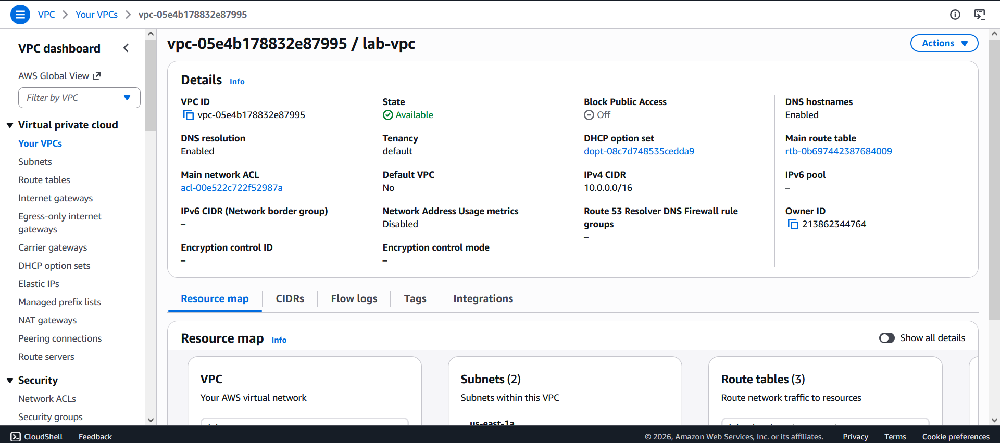
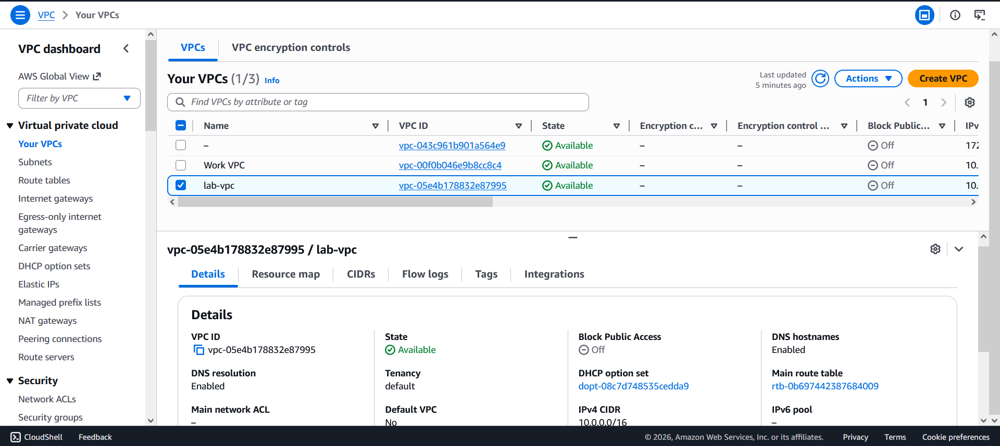
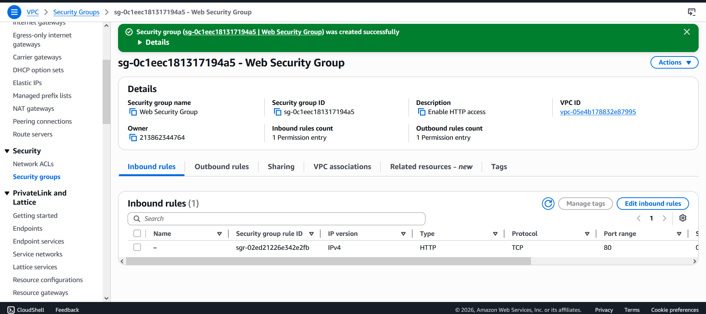
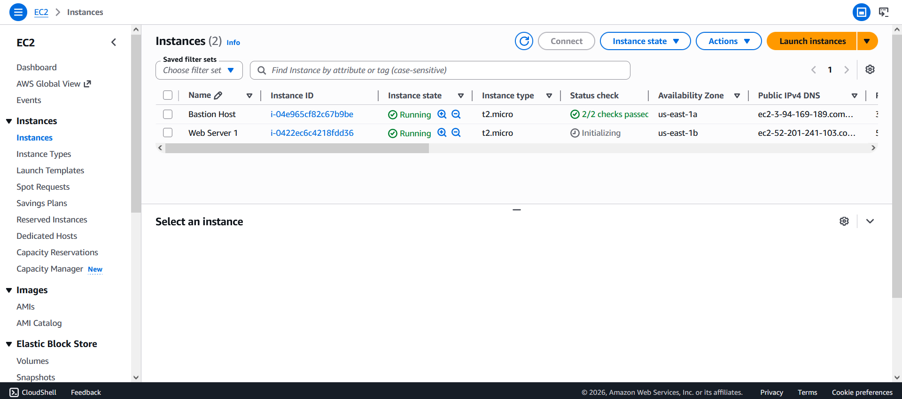
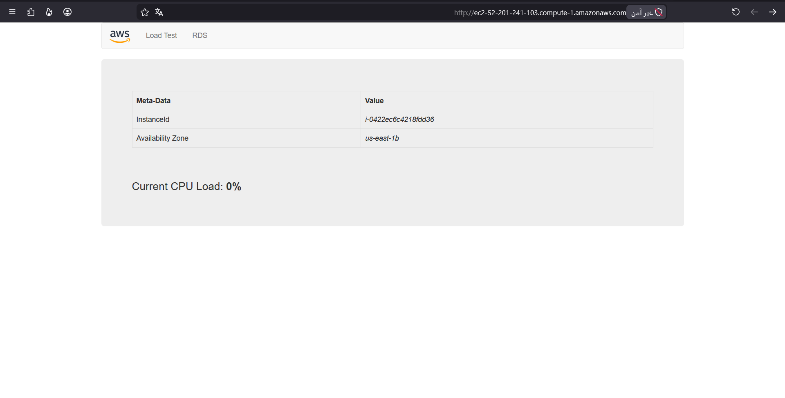

# 🌐 AWS VPC & Web Server Lab

> Build a custom Virtual Private Cloud (VPC) and deploy a live web server on Amazon EC2 — from scratch!

---

## 📋 Table of Contents

- [Overview](#-overview)
- [Objectives](#-objectives)
- [Architecture](#-architecture)
- [Prerequisites](#-prerequisites)
- [Lab Tasks](#-lab-tasks)
  - [Task 1: Create Your VPC](#task-1-create-your-vpc)
  - [Task 2: Create Additional Subnets](#task-2-create-additional-subnets)
  - [Task 3: Create a VPC Security Group](#task-3-create-a-vpc-security-group)
  - [Task 4: Launch a Web Server Instance](#task-4-launch-a-web-server-instance)
- [Tech Stack](#-tech-stack)
- [Key Concepts](#-key-concepts)
- [Duration](#-duration)

---

## 📌 Overview

This lab walks through building a production-style AWS networking environment using **Amazon VPC**. You'll configure subnets, route tables, gateways, and security groups — then deploy a fully functional **Apache web server** on an EC2 instance inside your custom VPC.

---

## 🎯 Objectives

By the end of this lab, you will be able to:

- ✅ Create a custom **Amazon VPC**
- ✅ Configure **public and private subnets** across multiple Availability Zones
- ✅ Set up **Internet Gateway** and **NAT Gateway**
- ✅ Configure **route tables** for traffic management
- ✅ Create a **VPC Security Group** as a virtual firewall
- ✅ Launch and configure an **EC2 instance** as a web server

---

## 🏗️ Architecture


---

## ✅ Prerequisites

- An active **AWS Account** (or access to an AWS lab environment)
- Access to the **AWS Management Console**
- Region: `us-east-1` (N. Virginia)
- Basic familiarity with AWS services

---

## 🛠️ Lab Tasks

### Task 1: Create Your VPC

Using the **VPC and more** wizard, provision:

| Resource | Name | Details |
|---|---|---|
| VPC | `lab-vpc` | CIDR: `10.0.0.0/16` |
| Public Subnet | `lab-subnet-public1-us-east-1a` | CIDR: `10.0.0.0/24` |
| Private Subnet | `lab-subnet-private1-us-east-1a` | CIDR: `10.0.1.0/24` |
| Internet Gateway | `lab-igw` | Attached to lab-vpc |
| NAT Gateway | `lab-nat-public1-us-east-1a` | In public subnet |
| Route Tables | `lab-rtb-public` / `lab-rtb-private1-us-east-1a` | Per subnet |



> 💡 The NAT Gateway takes a few minutes to activate — wait before proceeding!

---

### Task 2: Create Additional Subnets

Add a second set of subnets in **us-east-1b** for High Availability:

| Subnet | CIDR | AZ |
|---|---|---|
| `lab-subnet-public2` | `10.0.2.0/24` | us-east-1b |
| `lab-subnet-private2` | `10.0.3.0/24` | us-east-1b |

Then update **route table associations**:
- Associate `lab-subnet-private2` → `lab-rtb-private1-us-east-1a` (via NAT)
- Associate `lab-subnet-public2` → `lab-rtb-public` (via IGW)



---

### Task 3: Create a VPC Security Group

Create a virtual firewall to allow web traffic to your instance:

| Setting | Value |
|---|---|
| Name | `Web Security Group` |
| Description | `Enable HTTP access` |
| VPC | `lab-vpc` |
| Inbound Rule | HTTP, Anywhere-IPv4, `Permit web requests` |


---

### Task 4: Launch a Web Server Instance

Launch an **EC2 instance** with the following configuration:

| Setting | Value |
|---|---|
| Name | `Web Server 1` |
| AMI | Amazon Linux 2023 |
| Instance Type | `t2.micro` |
| Key Pair | `vockey` |
| VPC | `lab-vpc` |
| Subnet | `lab-subnet-public2` |
| Auto-assign Public IP | Enabled |
| Security Group | `Web Security Group` |



#### 🚀 Bootstrap Script (User Data)

The following script runs automatically on first launch to install and start the web server:

```bash
#!/bin/bash

# Install Apache Web Server and PHP
dnf install -y httpd wget php mariadb105-server

# Download Lab files
wget https://aws-tc-largeobjects.s3.us-west-2.amazonaws.com/CUR-TF-100-ACCLFO-2/2-lab2-vpc/s3/lab-app.zip

unzip lab-app.zip -d /var/www/html/

# Turn on web server
chkconfig httpd on
service httpd start
```

> ✔️ Wait for **2/2 status checks** to pass, then visit the Public IPv4 DNS in your browser to see the live web app!

---

## 🧰 Tech Stack


---

## 📚 Key Concepts

| Concept | Description |
|---|---|
| 🌐 **VPC** | Isolated virtual network in AWS |
| 🔀 **Subnet** | Segment of a VPC's IP range in one AZ |
| 🚪 **Internet Gateway** | Enables internet access for public subnets |
| 🔄 **NAT Gateway** | Gives private subnets outbound internet access |
| 🗺️ **Route Table** | Rules that direct where network traffic goes |
| 🛡️ **Security Group** | Stateful virtual firewall for EC2 instances |

---

## ⏱️ Duration

> Approximately **30 minutes** to complete all tasks.

---

## 📄 License

This lab is based on AWS Training content.
© 2023 Amazon Web Services, Inc. and its affiliates. All rights reserved.

---

<div align="center">
  Made with ❤️ while learning AWS Cloud Infrastructure
</div>